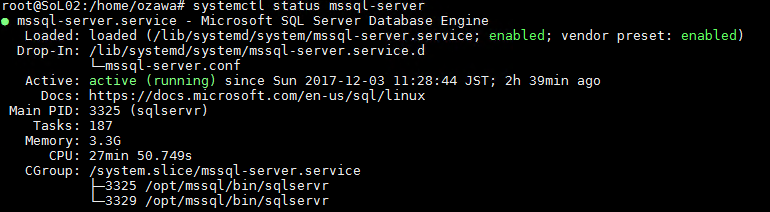

# はじめに
本ドキュメントは、Windows エンジニアが、Linux 上で動作する SQL Server (SQL Server on Linux) を操作するために必要となるスキルアップデートについての情報を記載したものとなります。  
(ドキュメント作成者が Ubuntu 16.04 LTS で検証をしているため、公開当初は Ubuntu ベースの情報となっています)

SQL Server on Linux の SQL Server 部分のスキルについては、Windows / Linux 版で共通となりますが、OS 部分に関しては、Windows エンジニアのスキルアップデートが必要になるものが多数あります。  

本ドキュメントが、今まで Windows をメインに触ってきたが、Linux の SQL Server を触る必要がある / 興味を持ったエンジニアの方の一助になれば幸いです。

# 目次
<!-- TOC -->

- [はじめに](#はじめに)
- [目次](#目次)
- [サービス管理](#サービス管理)
    - [サービス管理のファイル](#サービス管理のファイル)
    - [SQL Server の設定変更](#sql-server-の設定変更)
    - [ファイアウォール](#ファイアウォール)
        - [Ubuntu](#ubuntu)
        - [RHEL](#rhel)
    - [リモート接続](#リモート接続)
        - [リモート管理](#リモート管理)
        - [ファイルコピー](#ファイルコピー)
    - [ソフトウェア更新](#ソフトウェア更新)
- [ベストプラクティス](#ベストプラクティス)
    - [SQL Server on Linux](#sql-server-on-linux)
        - [SQL Server の設定](#sql-server-の設定)
            - [PROCESS AFFINITY の指定](#process-affinity-の指定)
            - [tempdb のデータファイルの分割](#tempdb-のデータファイルの分割)
            - [mssql-conf ツールを使用したメモリ設定](#mssql-conf-ツールを使用したメモリ設定)
        - [Linux の設定](#linux-の設定)
            - [CPU](#cpu)
                - [CPU の電力制御のユーティリティ](#cpu-の電力制御のユーティリティ)
                - [CPU クロックのガバナー](#cpu-クロックのガバナー)
                - [パフォーマンスと電源消費効率のバランス](#パフォーマンスと電源消費効率のバランス)
                - [CPU クロックの下限](#cpu-クロックの下限)
                - [C-State](#c-state)
    - [Docker](#docker)
    - [事前の IO 検証](#事前の-io-検証)
- [アカウント / グループ](#アカウント--グループ)
- [パフォーマンスモニタリング](#パフォーマンスモニタリング)
- [プロセス構成](#プロセス構成)
- [ディレクトリ構成](#ディレクトリ構成)
    - [Windows のディレクトリとの比較](#windows-のディレクトリとの比較)
- [ログファイル](#ログファイル)
- [データディスクのマウント](#データディスクのマウント)
- [システムデータベースの操作](#システムデータベースの操作)
    - [システムデータベースの再構築](#システムデータベースの再構築)
    - [システムデータベースの移動について](#システムデータベースの移動について)
- [可用性](#可用性)
- [オフラインインストール](#オフラインインストール)
    - [RHEL](#rhel-1)
    - [Ubuntu](#ubuntu-1)
- [コマンド](#コマンド)

<!-- /TOC -->


# サービス管理
Windows の場合、SQL Server は「Windows サービス」として管理が行われていましたが、Linux 版の場合は、Linux のシステム・サービスマネージャーである「[systemd](https://wiki.archlinux.jp/index.php/Systemd)」で管理が行われている。

本章では、Linux の SQL Server のサービス管理を実施するために必要となるコマンド等を記載している。

## サービス管理のファイル
SQL Server のサービス管理のファイルの実体は「/lib/systemd/system/mssql-server.service」となり、このファイルでサービス起動時の設定が行われる。  
- [9.6. システムのユニットファイルの作成および変更](https://access.redhat.com/documentation/ja-jp/red_hat_enterprise_linux/7/html/system_administrators_guide/sect-managing_services_with_systemd-unit_files)

```
$ sudo systemctl enable mssql-server.service
```

を実行することで、「/etc/systemd/system/multi-user.target.wants/mssql-server.service」にシンボリックリンクが作成され、自動起動の設定が行われている。

## SQL Server の設定変更
SQL Server on Windows では、SSMS / SQL Server 構成マネージャー / sp_configure を使用して設定の変更を行う。  

SQL Server on Linux では、これらに加えて、一部の設定については「mssql-conf」を使用して設定を変更する。  
- [Configure SQL Server on Linux with the mssql-conf tool](https://docs.microsoft.com/en-us/sql/linux/sql-server-linux-configure-mssql-conf)  

「mssql-conf」で変更可能な設定については、他の方法で変更が可能だったとしても、このツールから変更を行わないと、SQL Server のサービスを再起動することで、初期化されてしまうので注意が必要である。  
(SQL Server on Linux の基本部分はサンドボックス環境で動作しており、サービスの再起動を実施すると、初期状態に初期化されるた、ツールを使用して、起動時に設定を外部からインポートさせる必要がある)

## ファイアウォール
Windows の場合、Windows Firewall で SQL Server のポート (TCP:1433 (SQL Server) / UDP : 1434 (SQL Server Browser) のアクセス開放を実施している。  
Linux の場合、使用するディストリビューションに応じたファイアウォールにより、TCP 1433 (デフォルトインストール時) にアクセスするための設定を行う。

### Ubuntu
Ubuntu 16.04 LTS はデフォルトは FW は無効

|コマンド|ufw|

```
$ sudo ufw allow 1433/tcp 
```

[ufwの基本操作](https://qiita.com/RyoMa_0923/items/681f86196997bea236f0)

### RHEL

|コマンド|firewalld|

[4.5. ファイアウォールの使用](https://access.redhat.com/documentation/ja-jp/red_hat_enterprise_linux/7/html/security_guide/sec-using_firewalls)


## リモート接続
Windows の場合、「Remote Desktop」や、「クリップボード共有経由」等で管理やファイル転送を実施することが多い。  
Linux の場合、「SSH」「SCP」を使用して、リモート管理やファイル転送を実施する。

### リモート管理

|コマンド|ssh|

[インフラエンジニアじゃなくても押さえておきたいSSHの基礎知識](https://qiita.com/tag1216/items/5d06bad7468f731f590e)

### ファイルコピー

|コマンド|scp|

[SCP (1)](http://euske.github.io/openssh-jman/scp.html)

## ソフトウェア更新

```
# sudo apt update
# sudo apr upgrade
```

apt updateでパッケージ管理のデータベースを更新し、apt upgradeで実際にソフトウェアを更新する。

# ベストプラクティス
[Performance best practices and configuration guidelines for SQL Server 2017 on Linux](
https://docs.microsoft.com/en-us/sql/linux/sql-server-linux-performance-best-practices)

## SQL Server on Linux
### SQL Server の設定
#### PROCESS AFFINITY の指定
```
ALTER SERVER CONFIGURATION  
SET PROCESS AFFINITY NUMANODE = 0 TO <Max NUMA Node ID>
```

#### tempdb のデータファイルの分割
SQL Server on Linux は、インストール時の tempdb 分割が行われないため、インストール後に分割する。

#### mssql-conf ツールを使用したメモリ設定
```
$ sudo /opt/mssql/bin/mssql-conf set memory.memorylimitmb 4096
$ sud systemctl restart mssql-server
```
デフォルトでは SQL Server が使用するメモリは 80% に制限されているため、大容量のメモリを搭載している場合、残りの 20% のサイズによっては、上限緩和を検討する。  
(本設定は SQL Server の max server memroy とは別の設定)

設定の解除
```
sudo /opt/mssql/bin/mssql-conf unset memory.memorylimitmb 
systemctl restart mssql-server
```

### Linux の設定
- PASS Summit 2017 - SQL Server on Linux: DBA focused lessons learned from early deployments
- [Inside SQL Server 2017 on Linux](https://onedrive.live.com/?authkey=%21ABg4T%5Fv1nZbdDbE&id=233BB03122CBD248%21249941&cid=233BB03122CBD248)
- [SQL Server 2017 on Linux - Administration](https://www.slideshare.net/heraflux/sql-server-2017-on-linux-administration)
- [How to safeguard SQL Server on Linux from OOM-Killer](https://blogs.msdn.microsoft.com/psssql/2017/10/17/how-to-safeguard-sql-server-on-linux-from-oom-killer/)


#### CPU

##### CPU の電力制御のユーティリティ
```
# apt install -y cpufrequtils
# cpufreq-info
```

##### CPU クロックのガバナー
```
$ sudo cpupower frequency-info
$ sudo cpupower frequency-set -g performance
```

##### パフォーマンスと電源消費効率のバランス
```
# x86_energy_perf_policy -v 'performance'
```

##### CPU クロックの下限
tuned を使用して設定を実施
```
min_perf_pct=100
```
- [2.5. TUNED および KTUNE](https://access.redhat.com/documentation/ja-jp/red_hat_enterprise_linux/6/html/power_management_guide/tuned)

##### C-State
C1 のみにする
```
$ sudo vi /etc/default/grub
====
GRUB_CMDLINE_LINUX_DEFAULT="intel_idle.max_cstate=1"
====
$ sudo update-grub
$ reboot
```
- [How to set intel_idle.max_cstate=1](https://askubuntu.com/questions/749349/how-to-set-intel-idle-max-cstate-1)


## Docker
- ローカルまたはリモートストレージ / コンテナーボリュームのマウントを検討
- Docker ボリュームストレージプラグインの活用
- Docker run の実行時に --cap-add sys_ptrace の活用

## 事前の IO 検証
- FIO / dd / Iometer 等による事前のディスク性能の検証
- SQL Server on Linux では、ファイルの瞬時初期化はデフォルトで有効となっている
- マウントしたドライブを使用している場合「/etc/fstab」の「noattime」の設定の有効化


# アカウント / グループ
Windows の場合、アカウントについては「SQL Server のサービスを起動しているサービスアカウント」を基準に各種設定を考慮する必要がある。

Linux の場合、アカウント / グループともに「mssql」が使用されている。  
バックアップや BULK INSERT をするファイルに対しては、「mssql」を基準に考慮する必要がある。
```
id mssql
uid=999(mssql) gid=999(mssql) groups=999(mssql)
```
「systemctl」からではなく、コマンドで起動する場合は次のようなコマンドを実行する。  
「root」で起動した場合、一部ファイルのアクセス権が変更され、以降 mssql で起動しようとした場合にエラーとなる可能性があるため、コマンドラインからの起動は注意をする。
```
$ sudo -u mssql /opt/mssql/bin/sqlservr
```

# パフォーマンスモニタリング
// TODO

# プロセス構成
メインの PID で、SQL PAL Monitor が動作し、子プロセスで、SQL PAL / sqlservr.exe が動作する構成となっており Windows とは異なり 2 このプロセスが起動することになる。
  
SQL Server Agent / Full Text Search をインストールした場合、sqlservr のプロセス内で動作することになるため、個別にサービスを停止することはできない


# ディレクトリ構成

|ディレクトリ|用途|
|:-|:-|
|/opt/mssql|バイナリ|
|/var/opt/mssql|データ/ログ|

## Windows のディレクトリとの比較

|Windows|Linux|
|:-|:-|
||/|
|C:\Users\<ユーザー名>|/home/<ユーザー名>|
|C:\Windows|/bin<br>/sbin|
|%WINDOWSTEMP%|/tmp|
|C:\Program Files|/opt<br>/usr/bin<br>/usr/local
|ライブラリ / ソースコード / バイナリ|/usr|
|システムログ|/var|

- [Filesystem Hierarchy Standard](https://ja.wikipedia.org/wiki/Filesystem_Hierarchy_Standard)

# ログファイル

|ディストリビューション|システムログ|
|:-|:-|
|RHEL|/var/log/messages|
|Ubuntu|/var/log/syslog|

|種別|ファイル|
|:-|:-|
|SQL Server ログ|/var/opt/mssql/log|
|セットアップログ|Debian Pakcage : /var/log/dpkg.log<br>RPM：/var/log/yum.log|

# データディスクのマウント
The systemd unit file for the SQL server should be locally extended by a dependency on the /datadir this will make sure the start is done after the mount and the unmount waits for the stop.  
The most generic option to do this would be  
```
RequiresMountsFor=/datadir
```
I think it automatically depend on the installation path of the scripts already.  
Note that you do not need to modify the systemd unit files in the library directory but you can amend them in the  
```
/etc/systemd/system/<sqlserver>.service
```

```
# systemctl show --no-pager mssql-server | grep "RequiresMountsFor"
# mkdir /lib/systemd/system/mssql-server.service.d
# vi /lib/systemd/system/mssql-server.service.d/mssql-server.conf
====
[Unit]
RequiresMountsFor=/mnt/backup
====
# systemctl daemon-reload
# systemctl show --no-pager mssql-server | grep "RequiresMountsFor"
```
- [systemdでmount完了を待ってサービスを起動する](https://qiita.com/ko-zu/items/3759144c53904afe6b76)

# システムデータベースの操作
## システムデータベースの再構築
```
# /opt/mssql/bin/sqlservr -c --setup --force-setup
```
## システムデータベースの移動について
- tempdb / msdb / model : ALTER DATABASE で移動
- master : 移動することはできない

# 可用性
Windows の場合は、OS に含まれている Windows Server Failover Cluser (WSFC) を使用して、OS 側の可用性環境の構築を行い、その上で SQL Server の可用性環境を構築することがある。

Linux 環境では WSFC を利用することはできないため、OS の可用性環境を構築する手法として、2017/12 時点では OSS のソフトウェアである「Pacemaker」を利用した方法が、Microsoft 社からドキュメントで公開されている。  
(今後、他のクラスターマネージャー/3rd 製品での対応等が行われる可能性もある)

Pacemaker の操作方法については、次の情報が参考となる。

- [High Availability Add-On リファレンス](https://access.redhat.com/documentation/ja-jp/red_hat_enterprise_linux/7/html/high_availability_add-on_reference/)
- [第1章 Pacemaker を使用した Red Hat High Availability クラスターの作成](https://access.redhat.com/documentation/ja-jp/red_hat_enterprise_linux/7/html/high_availability_add-on_administration/ch-startup-haaa)
- [第3章 pcs コマンドラインインターフェース](https://access.redhat.com/documentation/ja-jp/red_hat_enterprise_linux/7/html/high_availability_add-on_reference/ch-pcscommand-haar)
- [付録B pcs コマンドの使用例](https://access.redhat.com/documentation/ja-JP/Red_Hat_Enterprise_Linux/6/html/Configuring_the_Red_Hat_High_Availability_Add-On_with_Pacemaker/ap-configfile-HAAR.html)

# オフラインインストール
## RHEL
```
# yumdownloader --downloadonly --resolve --destdir=/home/user/offlineistall mssql-server
```

## Ubuntu
```
apt-get download mssql-server
apt-cache depends mssql-server
```

- [Offline install](https://docs.microsoft.com/en-us/sql/linux/sql-server-linux-setup#offline)
- [sqlunattended](https://github.com/denzilribeiro/sqlunattended)

# コマンド
// TODO